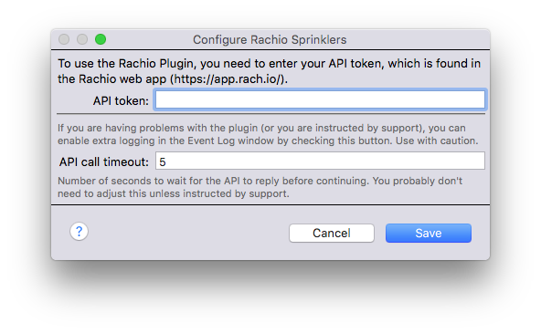
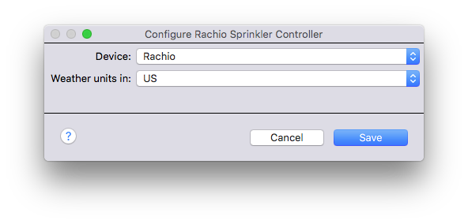

Rachio Sprinkler
================

This is a plugin for the [Indigo](http://www.indigodomo.com/) smart home server that will integrate  [Rachio Sprinkler controllers](http://rachio.com) as standard Indigo sprinkler devices.

### Requirements

Any Rachio device that is supported by [v1 of their API](https://rachio.readme.io/v1.0/docs) is supported.

### Installation Instructions

1. Download latest release [here](https://github.com/IndigoDomotics/INSERTLINKHERE).
2. Follow [standard plugin installation process](http://wiki.indigodomo.com/doku.php?id=indigo_7_documentation:getting_started#installing_plugins_configuring_plugin_settings_permanently_removing_plugins).

### Usage

To configure the plugin, you need to enter your API access token into the plugin's config dialog (**`Plugins->Rachio Sprinklers->Configure...`**).

You can find your API key in your Rachio web account. You probably don't need to adjust the API timeout, but if you have frequent timeout errors then increasing by a couple of seconds may help.

Once you have the plugin configured, you can use the standard [Indigo device creation process](http://wiki.indigodomo.com/doku.php?id=indigo_7_documentation:overview#devices). Select **`Rachio Sprinklers`** as the type and **`Rachio Sprinkler Controller`** as the model. When you do that, you'll get the **`Configure Rachio Sprinkler Controller`** dialog:

Select a Rachio device from the first popup and select US (imperial) or Metric for units of measure when retrieving weather data. Save the dialog.

This will create a standard [Indigo sprinkler device](http://wiki.indigodomo.com/doku.php?id=indigo_7_documentation:overview#sprinkler_controls), which works like any other sprinkler device. There are some differences though: the Rachio device will have a bunch of extra states that show information about the device, including current weather conditions and a two week forecast. See below for details on the extra states.

**NOTE** - when Indigo is running Indigo schedules, the Rachio apps and website may not correctly display the status of the sprinkler. This has been reported to Rachio, but there is currently no way around it. If you are using standard Indigo sprinkler schedules, then you'll want to always check the status via Indigo (or Indigo Touch) as you may not see correct information in the Rachio apps. Indigo will always show correct status regardless of whether it's running an Indigo schedule or one stored in the Rachio.

### Actions

The plugin supports a couple of custom actions:

* **Run Rachio Schedule** - Allows you to immediately run a schedule defined in the Rachio interface. Note that onlysome Rachio schedules can be run on demand.
* **Set Seasonal Adjustment** - Allow's the user to set a seasonal adjustment for the specified schedule. The value is a percentage from -100% to 100% of the standard/specified runtime.
* **Set Standby Mode** - Allows the user to set the controller's standby mode. If the controller is in standby mode, it is not automatically running any of it's built-in schedules or performing any other logic. Indigo would be the only thing controlling any watering done by the controller. Standby mode is off by default. Note - Indigo schedules will run correctly even if the controller is not in standby mode.

### States

Rachio Indigo devices have a lot of custom states. Some describe attributes of the controller device itself, most of which are dedicated to current weather conditions and forecast data. We'll define the device information states first, then the forecast data states.

#### Device Information

| State                | Type    | Description                                                                                                                                                                                                                  |
|:---------------------|:--------|:-----------------------------------------------------------------------------------------------------------------------------------------------------------------------------------------------------------------------------|
| activeSchedule       | String  | Name of the currently active schedule. "MANUAL" if it's running an Indigo schedule, otherwise the name of the Rachio schedule running.                                                                                       |
| address              | String  | MAC address of the controller.                                                                                                                                                                                               |
| elevation            | Float   | Elevation of the controller above sea level (units based on device configuration).                                                                                                                                           |
| id                   | String  | The UUID of the device as provided by Rachio.                                                                                                                                                                                |
| inStandbyMode        | Boolean | False if the controller is automatically running it's own schedules and performing it's own logic, True otherwise. Indigo schedules will run regardless of this state value.                                                 |
| latitude & longitude | Float   | The latitude and longitude of the device.                                                                                                                                                                                    |
| model                | String  | The Rachio model number of the controller.                                                                                                                                                                                   |
| name                 | String  | The name of the controller as defined by the user in the Rachio interface. Separate from the Indigo device name.                                                                                                             |
| paused               | Boolean | True if a controller schedule is paused, False otherwise. Currently, the controller can't pause one of it's internal schedules so this value should always be False.                                                         |
| scheduleModeType     | String  | MANUAL if the last schedule that was run was a manual schedule, AUTOMATIC otherwise.                                                                                                                                         |
| serialNumber         | String  | The serial number of the controller.                                                                                                                                                                                         |
| status               | String  | ONLINE if the controller is communicating with the Rachio servers, OFFLINE if not. The controller may still be operating if not in standby mode, but it hasn't communicated with the Rachio servers for some period of time. |
| timeZone             | String  | Name of the time zone that the controller is in.                                                                                                                                                                             |
| utcOffset            | Integer | Offset between the time zone and GMT.                                                                                                                                                                                        |

#### Current Weather

These states represent the current weather conditions. Any totals are for the day. Measurements are in units specified in the device config (see above).

| State                      | Type    | Description                                                                                             |
|:---------------------------|:--------|:--------------------------------------------------------------------------------------------------------|
| current_calculatedPrecip   | Float   | Total precipitation                                                                                     |
| current_cloudCover         | Integer | Percentage of cloud cover                                                                               |
| current_currentTemperature | Float   | Temperature                                                                                             |
| current_dewPoint           | Float   | Dew Point                                                                                               |
| current_humidity           | Integer | Humidity percentage                                                                                     |
| current_iconUrl            | String  | URL to a Rachio-provided icon that represents the weather conditions (see current_weatherType below)    |
| current_precipIntensity    | Float   | Intensity of precipitation                                                                              |
| current_precipProbability  | Integer | Percentage chance of precipitation                                                                      |
| current_weatherSummary     | String  | Brief string summarizing the current conditions                                                         |
| current_weatherType        | String  | An enumeration describing the overall conditions (see [Weather Type Enumeration](#weather-type-enumeration) below for details) |
| current_windSpeed          | Float   | Wind speed                                                                                              |

#### Weather Forecast

Forecast data is available for 14 days including the current day. In the list below, substitute the value of the **_#_** in the state names for the day. 0=Today, 1=Tomorrow, all the way to 13, which is today + 13 days on the calendar.

| State                        | Type    | Description                                                                                                                    |
|:-----------------------------|:--------|:-------------------------------------------------------------------------------------------------------------------------------|
| t#forecast_calculatedPrecip  | Float   | Total precipitation                                                                                                            |
| t#forecast_cloudCover        | Integer | Percentage of cloud cover                                                                                                      |
| t#forecast_dewPoint          | Float   | Dew Point                                                                                                                      |
| t#forecast_humidity          | Integer | Humidity percentage                                                                                                            |
| t#forecast_iconUrl           | String  | URL to a Rachio-provided icon that represents the weather conditions (see current_weatherType below)                           |
| t#forecast_precipIntensity   | Float   | Intensity of precipitation                                                                                                     |
| t#forecast_precipProbability | Integer | Percentage chance of precipitation                                                                                             |
| t#forecast_temperatureMax    | Float   | High temperature                                                                                                               |
| t#forecast_temperatureMin    | Float   | Low temperature                                                                                                                |
| t#forecast_weatherSummary    | String  | Brief string summarizing the current conditions                                                                                |
| t#forecast_weatherType       | String  | An enumeration describing the overall conditions (see [Weather Type Enumeration](#weather-type-enumeration) below for details) |
| t#forecast_windSpeed         | Float   | Wind speed                                                                                                                     |

#### Weather Type Enumeration

| Value               | Meaning                      |
|:--------------------|:-----------------------------|
| sun                 | Sunny                        |
| clear-day           | Clear during the day         |
| clear-night         | Clear at night               |
| cloudy              | Cloudy                       |
| partly-cloudy-day   | Partly cloudy during the day |
| partly-cloudy-night | Partly cloudy at night       |
| wind                | Windy                        |
| fog                 | Foggy                        |
| rain                | Raining                      |
| sleet               | Sleeting                     |
| snow                | Snowing                      |

Probably the best use of these enumerated values is for custom state images on control pages. If you come up with some nice images, share them in the [Contribution Library](https://www.indigodomo.com/library/).

### Troubleshooting

Debugging information is written to the plugin's log file, located here:

`/Library/Application Support/Perceptive Automation/Indigo 7/Logs/opensource.rachio/plugin.log`

Feel free to dig through there to see if there's anything helpful. Post questions on [the Rachio plugin topic on our forums](http://forums.indigodomo.com/viewtopic.php?f=65&t=18321).